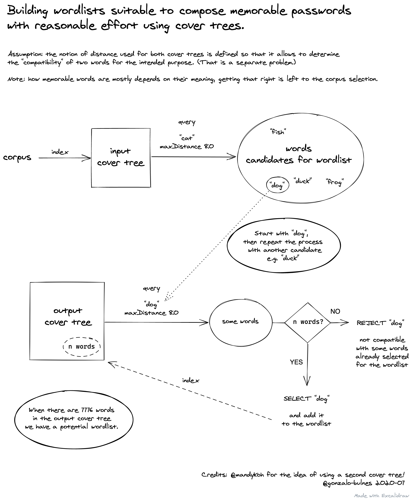

Cover
=====

An exploration of the cover tree structure applied to the composition of wordlists suitable to create memorable passphrases.

Spike: create a cover tree of words
-----------------------------------

### Goal

Understand the most basic use of [go-covertree][gct] and [golang-levenshtein][gl].

  [gct]: https://github.com/mandykoh/go-covertree
  [gl]: https://github.com/texttheater/golang-levenshtein

### Usage

```sh
go run github.com/gonzalo-bulnes/cover
```

Spike: proof of concept (edit distance)
---------------------------------------

### Goal

Understand if the cover tree can be used to pre-select groups of words that have a given edit distance between them (all of them). That would could be used to allow **automated error correction** across a wordlist.

> [In the second short list, all] words are at least an edit distance of 3 apart. This means that future software could correct any single typo in the user's passphrase (and in many cases more than one typo). (source: [EFF's New Wordlists for Random Passphrases](https://www.eff.org/deeplinks/2016/07/new-wordlists-random-passphrases))

#### Steps

- [x] Define a notion of `distance.ForErrorCorrection`.
- [ ] Figure out if some property can be applied to all items (e.g. words) of a group (e.g. nearest neighbours of a given word).

### Usage

```sh
PRINT=true go run github.com/gonzalo-bulnes/cover
```

### Scratchpad

Typical constraints (to consider, unless they're at the corpus level):

- no word is an exact prefix of any other
- edit distance >= 3 between all the words
- words are as short as reasonable
- words are as recognized / memorable as possible (corpus)

Random thoughts:

- the edit distance increases when a word is longer than the other
- ideally for a passphrase wordlist, shorter words tend to be better (ignoring the words meaning for now)
- it may be that targeting "at minimum 3 and as close as possible to 3" as the edit distance constraint could be interesting
- it could be interesting to be able to modify independently the influence of the word length and the similarity with other words of same length


1. insert all word from corpus into tree
2. find 7776 nearest from some word
3. find the 7776 nearest from each word in that set
4. if there are any less than 7776 nearest, exclude the word that is being used as reference
5. and start again!

- https://en.wikipedia.org/wiki/Soundex
- https://wordnet.princeton.edu/

Cover tree for checking candidates!

1. insert all word from corpus into tree
2. find 7776 nearest from some word
3. insert the first word into a new cover tree (output tree)
4. query that output tree using the first word in the list of neighbours, insert it (it will fit)
5. query the output tree using the second neighbour, check that it results in all two previous words, and insert. Otherwise reject.
6. Iterate with the third neighbour etc.

Spike: add proof-of-concept distance for wordlists
--------------------------------------------------

### Goal

Understand if a distance could be defined that would cover the constraints of composing a wordlist for memorable passphrases.

### Notes

I'm considering at this point:

1. words not being exact prefixes of each others is a requirement (it is relatively easy anyway)
2. having mostly short words is highly desirable
3. a minimal edit distance of `3` is nice to have

If the initial word in the list is short, the longer words will be further away in terms of _edit distance_ (Levenshtein), so the second objective can be covered by selecting the words that are closer to a short word, but more than 3 edits apart.

**Note**: composing a word list from the ideas above (with two cover trees) means depending on the order in which candidates words are inserted in the output cover tree. That means there could be some trial and error to get to the "best" wordlist; defining what "best" means seems necessary and finding ways to evaluate wordlists automatically would be valuable.

Idea: the quality of the corpus will matter, because the cover trees are not going to bring anything in that space. Considering that I have a Spanish wordlist that has already been through a few initial reviews, maybe using it as input for a short list would make for interesting test data. (The additional rule: "no two words start by the same three letters" could easily be added to `distance.Distance` for the purpose of making the exercise actually useful.)

### Whiteboard

Find a [zoomable version of the whiteboard on Excalidraw.com](https://excalidraw.com/#json=5174719347163136,4eLjzfSmumg7AgVgqoVPHw).



### Usage

```sh
# MIN_DISTANCE: minimum edit distance between any two words
# MAX_DISTANCE: maximum edit distance between any two words
# CORPUS_PATH: path of the corpus file
# NO_PREFIX: ensure that no word is an exact prefix of another
# NO_SAME_FIRST_THREE_LETTERS: ensure that no tow words start with the first three letters
#
# This is a very basic configuration system,
# set options to "" in order to use their default values.
CORPUS_PATH=file/testdata/corpus.txt MAX_DISTANCE=12 NO_PREFIX=true MIN_DISTANCE=3 NO_SAME_FIRST_THREE_LETTERS="" go run github.com/gonzalo-bulnes/cover
```

**Observations**: the concept works, remains to see if using cover trees makes performance significantly better. To verify that, a reference implementation is needed. (Also this is likely dependent on some characteristics of the corpus.)

Spike: benchmarks!
------------------

### Goal

Understand how benchmarks are written in Go and whether using cover trees is useful for the purpose of preparing wordlists that are suitable for the creation of memorable passphrases.

### Results

```sh
go test -bench=.

# /!\ Output truncated for clarity.

# Corpus of 5 words:
BenchmarkReferenceImplementation-12    	   70285	     17572 ns/op
BenchmarkTwoCoverTrees-12              	   27267	     44016 ns/op
BenchmarkSingleCoverTree-12            	   40116	     29963 ns/op

# Corpus of 1296 words (EFF short list 2.0):
BenchmarkReferenceImplementation-12    	     393	   3116440 ns/op
BenchmarkTwoCoverTrees-12              	       2	 512458768 ns/op
BenchmarkSingleCoverTree-12            	      21	  52728567 ns/op

# Corpus of 7776 words (EFF long list):
BenchmarkReferenceImplementation-12    	      36	  32073703 ns/op
BenchmarkSingleCoverTree-12    	               3	 433761024 ns/op
```

### Conclusions

None of the three implementations is likely to be as fast as it could be, that being said, **the reference implementation is significantly _faster_ than the proposals that use cover trees**.

In these benchmarks, narrowing the corpus using an _input cover tree_ is obviously a disadvantage because the corpus is small to start with. However, on second thought, it is unlikely anyone would use a massively oversized corpus because it would necessarily contain increasingly rare words (which are less useful for creating memorable passphrases).

Somewhat for the same reasons, the benchmarks with 1296 and 7776 words are realistic production scenarios, and the reference implementation remains significantly faster (_disappointed sigh_).

I would expect the cover trees to become eventually a better option when the corpus size increases, but clearly that goes out of the scope of creating memorable passphrases.

Outcomes & next steps
---------------------

The reference implementation is fast enough to be convenient, and being able to pre-compose wordlists quickly seems definitely useful. Making a _useable_ tool out of this last spike seems like it could be useful.

### Further thoughts

Depending on the results of using that tool, it may become interesting to be able to generate series of pre-composed wordlists (the final composition depends on the order in which words were selected) in order to achieve either larger lists (to reach, for example the 7776 words mark) or lists with more specific constraints. For that exercise, using cover trees would have the potential of re-using the indexing time for multiple wordlists and that may prove to bring speed benefits over a reference implementation based on independent loops. _To keep in mind._
